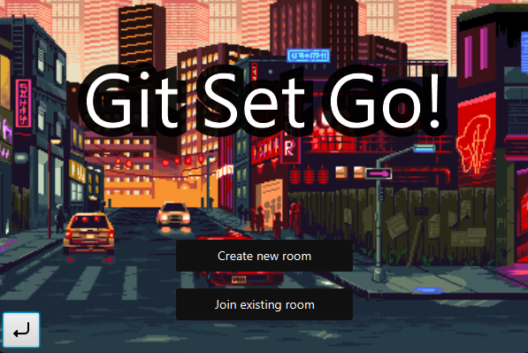
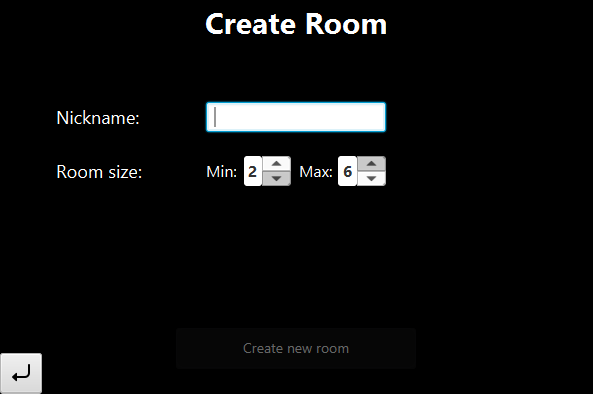
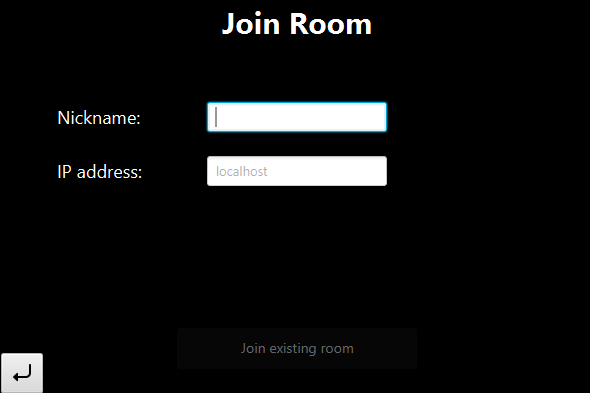
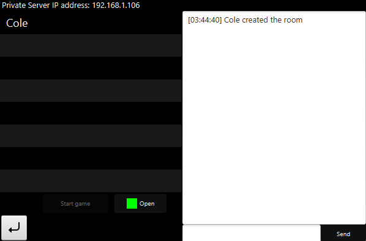
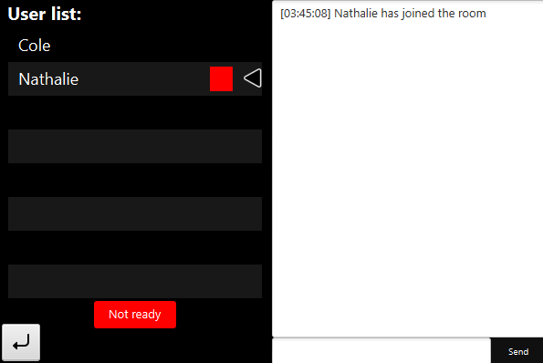
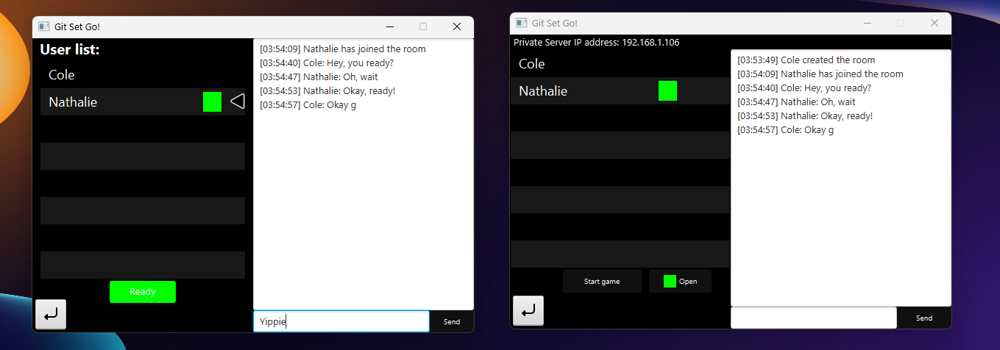
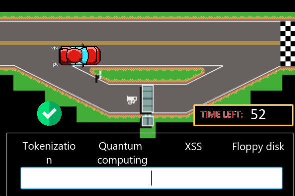
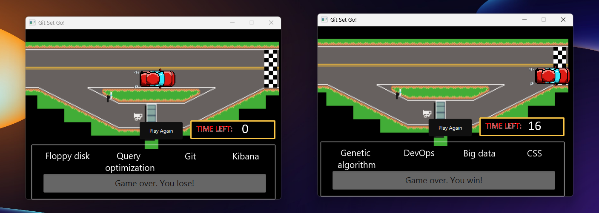

# Git Set Go: A Tech-Themed Multiplayer Typeracer Game

## Description
Git Set Go is a Java-based multiplayer typeracer game using UDP socket programming.

## Technologies Used

## Usage
To run the project, follow these steps:

1. Clone the repository: `https://github.com/coleenagsao/javafxml-typeracer-multiplayer`
2. Run `main.jar`.
3. To create a server, click the Create new room.
4. To join a room, enter the nickname and server IP address. Click join existing room.
5. The players can chat in the waiting room.
4. Once everyone is ready, the host can start the game.
5. Start typing when the game begins.

## Screenshots

*Screenshot of the Splash Screen*

*Screenshot of the Create Room for host*

*Screenshot of the Join Room for players*

*Screenshot of the Host's Waiting Room*

*Screenshot of the Player's Waiting Room*

*Screenshot of the Chat Functionality*

*Screenshot of Typeracer Game*

*Screenshot of Win-Lose Screen*

## License
This project is licensed under the [Creative Commons Attribution-NonCommercial-ShareAlike (CC BY-NC-SA) 4.0 International License](https://creativecommons.org/licenses/by-nc-sa/4.0/).

## Additional Notes
Space Shooters is an academic project developed as a part of CMSC 22 (Object-Oriented Programming) in UPLB. 